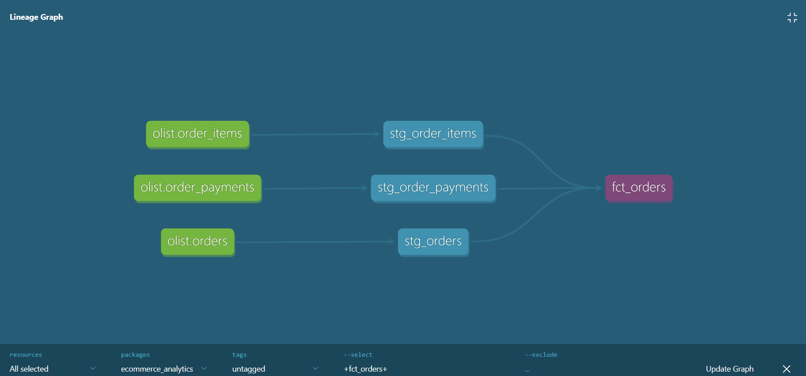
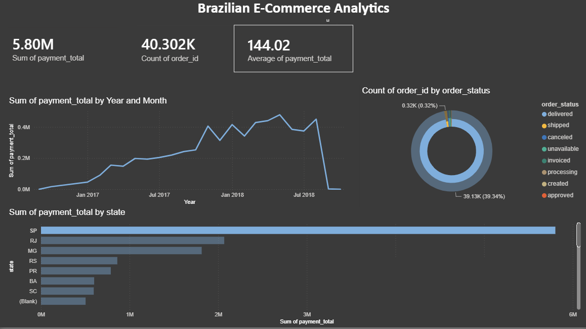

# Brazilian E-Commerce Analytics — dbt + PostgreSQL

An end-to-end analytics engineering project that transforms ~1.5M rows of raw Brazilian e-commerce data (the [Olist dataset](https://www.kaggle.com/datasets/olistbr/brazilian-ecommerce)) into a tested, documented dimensional model, surfaced through a Power BI dashboard.

The project follows modern analytics engineering practices: modular SQL transformations with dbt, a star-schema mart layer, automated data-quality testing, CI/CD, and a containerized environment.

---

## Architecture

Raw data flows through three layers — staging, dimensional marts, and a BI dashboard — orchestrated entirely by dbt:

```
Raw (PostgreSQL)  →  Staging (dbt views)  →  Marts (dbt tables, star schema)  →  Power BI
```



*dbt automatically generates this lineage graph from `ref()` and `source()` dependencies — no manual mapping.*

---

## Dashboard

A Power BI dashboard connected directly to the marts layer, delivering the full pipeline as a business-facing product.



**Key findings from the data:**
- **97%** of orders reach `delivered` status — a healthy fulfillment rate.
- Revenue grew sharply from late 2016 through 2018 as the platform scaled.
- **São Paulo (SP)** dominates revenue, consistent with Brazil's economic geography.
- Average order value: **~161 BRL** across **99,441** orders.

---

## Technical highlights

| Area | Implementation |
|------|----------------|
| **Transformation** | 8 staging models + 3 dimensional marts (`dim_customers`, `dim_products`, `fct_orders`) |
| **Modeling** | Star schema; fact table built at the order grain with fan-out prevention (pre-aggregated CTEs before joins) |
| **Testing** | Automated `unique`, `not_null`, `relationships`, and `accepted_values` tests on keys and critical columns |
| **Incremental logic** | `fct_orders` materialized incrementally using an `is_incremental()` filter to process only new records |
| **Historical tracking** | SCD Type 2 snapshot on `order_status` to preserve status-change history over time |
| **Documentation** | Auto-generated docs and lineage via `dbt docs` |
| **CI/CD** | GitHub Actions workflow spins up an ephemeral PostgreSQL service and validates the project on every push |
| **Containerization** | `docker-compose.yml` provisions a reproducible PostgreSQL 16 environment with one command |

---

## Tech stack

**dbt** · **PostgreSQL 16** · **Power BI** · **Docker** · **GitHub Actions** · **SQL** · **Git**

---

## Project structure

```
ecommerce_analytics/
├── models/
│   ├── staging/          # 8 staging models + sources.yml
│   └── marts/            # dim_customers, dim_products, fct_orders + schema.yml (tests)
├── snapshots/            # SCD Type 2 snapshot on order status
├── ci/                   # CI-specific profiles for GitHub Actions
├── .github/workflows/    # CI pipeline definition
├── images/               # lineage graph + dashboard screenshots
├── docker-compose.yml    # reproducible PostgreSQL environment
└── dbt_project.yml
```

---

## Running the project

**Prerequisites:** Docker, dbt (`dbt-postgres`), and the Olist dataset from Kaggle.

```bash
# 1. Spin up PostgreSQL in a container
docker compose up -d

# 2. Load the raw Olist CSVs into the `raw` schema
#    (see load script; data is not committed to the repo)

# 3. Build the models
dbt run

# 4. Run data-quality tests
dbt test

# 5. Capture snapshots (SCD Type 2)
dbt snapshot

# 6. Generate and serve documentation
dbt docs generate && dbt docs serve
```

---

## Design decisions

A few deliberate choices worth noting:

- **`fct_orders` is built at the order grain**, not the item grain — so product-level analysis would require a separate `fct_order_items` fact. This keeps the order fact clean and avoids double-counting.
- **The high-volume `geolocation` table was intentionally excluded** from the pipeline: it isn't required by any downstream mart and would add cost without analytical value.
- **`cast()` (ANSI SQL) is used throughout** instead of Postgres-specific `::` shorthand, keeping the models portable across warehouses.

---

## Author

**Saba Aslani** — Data Analyst / Analytics Engineer

- Portfolio: [saba-aslani.github.io](https://saba-aslani.github.io)
- GitHub: [@saba-aslani](https://github.com/saba-aslani)


